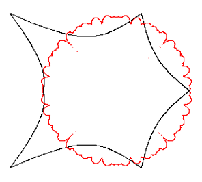

# Task 4: Superformula

A supershape is a complex shape that can be found in nature. It can be described using the superformula below:

Where 𝑟 is the distance between a point on the shape and its center. Different values of a, b, m1, m2, n1, n2, and n3 result in different shapes: see the two examples below. More examples can be found [here](https://en.wikipedia.org/wiki/Superformula).

A supershape may be created in Processing as follows: write a loop where 𝜃 is the loop counter that changes from 0 to a 2π with a very small increment. For each new value of 𝜃, compute 𝑟 using the superformula above. Then, use 𝑟 to compute the position of a point on the shape using the circle’s polar equations:
𝑥=𝑠𝑐𝑎𝑙𝑒∗ 𝑟∗ cos𝜃 and 𝑦=𝑠𝑐𝑎𝑙𝑒∗ 𝑟∗ sin𝜃,
where scale is the size of the shape (e.g. above shapes were produced using scale=100)
In this question, you are required to complete the missing code in the given starter code to produce two concentric supershapes similar to the output below.

**_Hint:_** You will need to use the built in Processing functions abs(), sin(), and pow() for your computations.

## Specifications

- We are expecting you to commit your work often (try to aim for a minimum of 3-5 commits per lab) with useful commit messages marking your progress.
- Using appropriate loop structure and values
- Correct computation of r
- Correct computation of x,y
- Using x,y, and r to draw the shape
- Drawing the red supershape (REQ2)

- **Optional** Gradually changing the color of each point on the shape as follows:

## Embed a screenshot of your drawing

Embed the screenshot you added to the `screenshots` directory here using markdown syntax:

