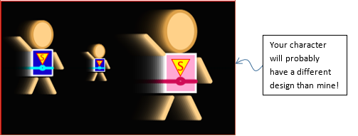

# Task 1: Hero Class

In this question, you will create a class named `Hero` for your custom character (the one that we created in the beginning of this semester). Here are the specs for the class:

- **Attributes**: `x`, `y`, `scale`, `speedX`, `speedY`, `torsoColor`, and `beltColor`.
- **Constructors**:
  - zero-argument constructor that sets attributes as: `x=width/2`, `y=height/2`, `scale=1`, `speedX=1`, `speedY=0`, `torsoColor=color(19,0,205)`, and `beltColor=color(0,255,255)` (your colors can be different of course).
  - 3-argument constructor to set `x`, `y` and `scale` to given values. Other attributes should use the same values used in the zero argument constructor. Use this header: `Hero(float x1, float y1, float scale1)`
  - 7-arg constructor to set all attributes to given values. Use this header: `Hero(float x1, float y1, float scale1, float sx, float sy, color torsoClr, color beltClr)`
- **Functions**:
  - `move()` to move the character and _wrap_ it around the screen when going outside sketch boundaries (e.g. when it passes the right edge, it should reappear at the left edge).
  - `display()` to draw the character as per the design that you made before.

## Specifications

- We are expecting you to commit your work often (try to aim for a minimum of 3-5 commits per lab) with useful commit messages marking your progress.
- Completing Hero class header and attributes.
- Using three constructors.
- Completing move function (with wrapping).
- Completing display function.

## Embed an animated gif of your drawing

Embed the animated gif you created here using markdown syntax: ``

